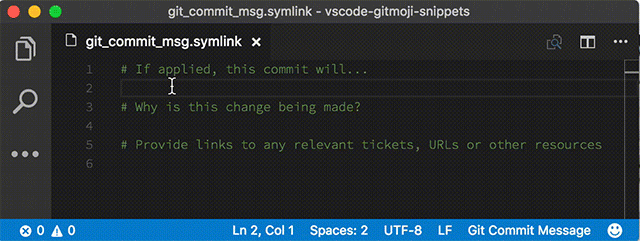

# "gitmoji" snippets package for Visual Studio Code

> Inspired by <a href="https://gitmoji.carloscuesta.me"></a>

This extension helps you to add emoji on your commit messages.
Using emojis on commit messages provides an easy way of identifying the purpose or intention of a commit with only looking at the emojis used.



## Getting started (MacOS)

1. [Set up VS Code to run from the terminal](https://code.visualstudio.com/docs/setup/mac#_command-line)
2. Make VS Code your default editor for Git

    Put this in your `.gitconfig` file :
    ```
    [core]
      editor = code --wait
    ```
3. Install the extension
4. Commit something and start typing some "prefix" ([see here](snippets/git-commit.json))
5. Enjoy!

## Frequently asked question

- Why using Visual Studio Code for commit messages?
    + Why not! 🙃

---

Credits: [Carlos Cuesta](https://gitmoji.carloscuesta.me)